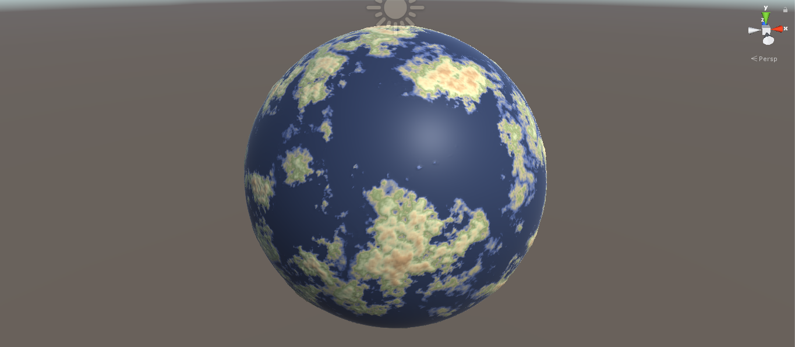

# ProceduralPlanets

This is my own take on Sebastian Lague's Unity planets in C#.

Each planet is procedurally generated from a unique seed, and can also be customized in the engine editor.

In this Unity project, [simplex noise](https://en.wikipedia.org/wiki/Simplex_noise) is wrapped around a cube and then [projected on to a sphere](http://mathproofs.blogspot.com/2005/07/mapping-cube-to-sphere.html).
The resulting noise-wrapped sphere can be used to create procedural terrain geometry, colors, oceans, and biomes.

There are some cool masking features that are used to blend different gradient color palettes. This results in a "biome" effect. For instance, a sandy color palette can be contrasted with a green color palette to create the effect of an earth-like planet. The height map can be flattened at a specified altitude and colored to create an adjustable ocean. There's also an additional masking layer that can be used to blend a biome away from the poles.
